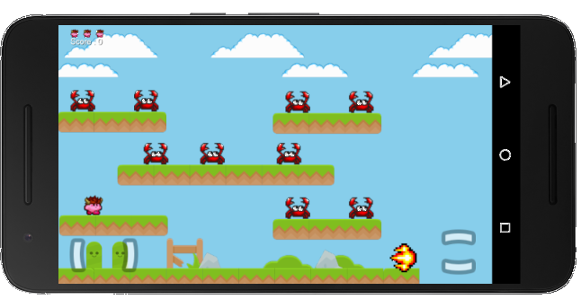

# Fiery-Kirby
Here is a platformer game with Kirby as main character which I made from scratch. Built using [Libdgx](https://libgdx.badlogicgames.com/) and designed using [Overlap2D](http://overlap2d.com/).

Compatible with Android/iOS/Desktop and web

Level demo https://youtu.be/vU91DTM5uts

## Features
With this game, you can:

* Blast awful crab enemies to smithereens

* Have the cutest looking kirby jumping around your screen

* Avoid getting hit, or its curtains for kirby

* Defeat all enemies to escape in a flying portal

* The best part: Game logic has been separated from world design. Now anyone can design their own level.

## GamePlay Video

Walkthrough of level 1 game play


Screenshot of game running on Android




## Credit
All sprites were obtained from [SpritersResource](http://www.spriters-resource.com/), http://kenney.nl/assets with catchy tunes from [Candy Valley](http://www.playonloop.com/2015-music-loops/candy-valley/)

Thanks to Mega Warp, SpriterTrooper, Drshnaps and Kenney

Kirby is © Nintendo and Hal Labs

## License
```
Copyright [2016] [Victor Akap Oben]

Licensed under the Apache License, Version 2.0 (the "License");
you may not use this file except in compliance with the License.
You may obtain a copy of the License at

    http://www.apache.org/licenses/LICENSE-2.0

Unless required by applicable law or agreed to in writing, software
distributed under the License is distributed on an "AS IS" BASIS,
WITHOUT WARRANTIES OR CONDITIONS OF ANY KIND, either express or implied.
See the License for the specific language governing permissions and
limitations under the License.
```
